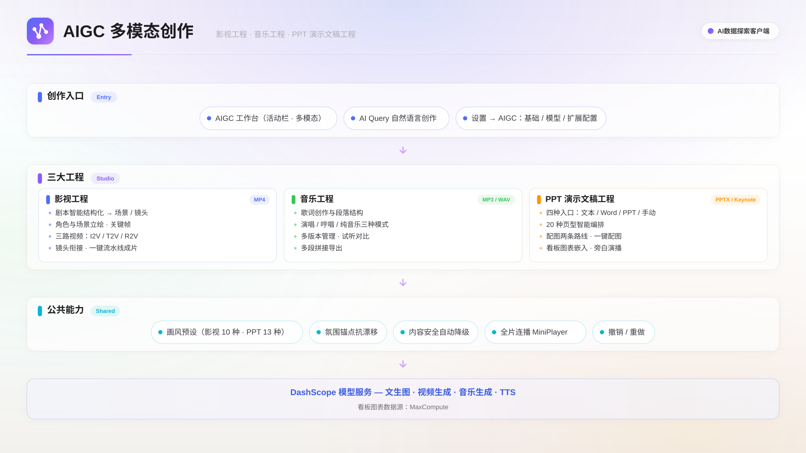

AIGC 创作工作室在客户端内完成 AI 视频、音乐与 PPT 演示文稿三类工程的生成与编排：可通过 AI Query 对话完成从创意构思到成品导出的全流程，也可在 AIGC 面板中直接操作。

## 功能概述

| 工程类型         | 创作能力                                                 | 导出格式       |
| ---------------- | -------------------------------------------------------- | -------------- |
| 影视工程         | 剧本结构化、角色与场景管理、三路视频生成、一键流水线出片 | MP4            |
| 音乐工程         | 歌词创作、演唱/哼唱/纯音乐三种模式、多段拼接             | MP3 / WAV      |
| PPT 演示文稿工程 | 导入文本/Word/PPT、AI 编排、配图、看板图表嵌入、旁白演播 | PPTX / Keynote |

AIGC 创作工作室的整体架构如下图所示。

## 前提条件

- 已在设置页完成 AIGC 模块配置（API 地址与密钥）。
- 本地已安装 ffmpeg，用于视频拼接与首尾帧提取。

## 设置与配置

在**设置 ▸ 多模态 ▸ AIGC** 标签页完成配置。开启**模块开关**后侧边栏显示 AIGC 入口；**API 地址**填写 DashScope / 百炼服务端点；**API 密钥**为百炼 API Key，驱动所有模型调用；ffmpeg 状态由客户端自动探测。

### 模型配置

| 方法                                                | 用途                                 |
| --------------------------------------------------- | ------------------------------------ |
| LLM                                                 | 剧本结构化、歌词创作、PPT 内容编排   |
| 文生图（T2I）与图像编辑                             | 关键帧、PPT 配图；图片精修与局部修改 |
| 图生视频（I2V）/ 文生视频（T2V）/ 参考生视频（R2V） | 三路视频生成，详见影视工程           |
| 视觉理解                                            | 画面识别与内容分析                   |
| 语音合成（TTS）                                     | 角色配音、PPT 旁白                   |
| 音乐生成                                            | 歌曲与纯音乐创作                     |

扩展配置：

- **音色克隆**：录制或上传一段参考音频，云端注册复刻并试听确认后，绑定到指定人物或旁白通道。克隆音色为账户级，跨项目复用。
- **产物归档**：把生成的产物自动归档到 MaxCompute 表，便于资产管理。

## 影视工程

影视工程面向「文本进、影片出」的创作流程：粘贴小说或剧本文本，客户端自动完成场景切分、角色与环境设定、关键帧绘制、视频生成、镜头衔接与拼接成片。

### 创建与结构化

在侧边栏 AIGC 面板单击**新建视频项目**，导入小说或剧本文本。系统自动结构化为 3~12 个场景片段，每个片段包含场景描述与关键帧 Prompt、运镜提示词（动作 + 镜头语言 + 声音提示）、角色对白与旁白及配乐/音效提示。支持指定片段数量，也可把新内容追加到现有片段后方。

在**角色管理**中定义角色名称、外貌描述与专属音色（系统预设或上传音频克隆），生成的立绘作为后续关键帧的参考素材，保持角色形象一致；在**环境管理**中定义场景环境的视觉描述和参考图。

### 三路视频生成

| 模式              | 特点                                     | 适用场景                              |
| ----------------- | ---------------------------------------- | ------------------------------------- |
| 图生视频（I2V）   | 以关键帧为首帧，画面可控，承接上一镜头   | 画面精确控制、镜头连贯                |
| 文生视频（T2V）   | 无需首帧，纯文本出片                     | 快速试片、无首帧约束                  |
| 参考生视频（R2V） | 最多 5 张参考图 + 文本描述，自动生成尾帧 | 多角色/多场景一致性，人物立绘直出片段 |

每个片段提供两档输出：**5 秒预览**（720P，快速验证运镜与画面）与**完整视频**（480P / 720P / 1080P 正式高清片段）。完整视频生成后，系统自动提取首尾帧，把尾帧作为下一段的首帧参考，实现镜头间自然过渡；运镜提示词末尾的「声音：…」子句驱动视频模型自动配乐，台词与旁白由视频模型原生发声。

视频生成模型按能力分档，在**设置 ▸ 多模态 ▸ AIGC** 中切换 I2V 模型（T2V 与 R2V 的可用模型随百炼侧上线情况变化）：

| 模型                                 | 分辨率              | 单段最长 | 特点                               |
| ------------------------------------ | ------------------- | -------- | ---------------------------------- |
| wan2.7-i2v / wan2.7-t2v / wan2.7-r2v | 720P                | 15 秒    | 默认选择，画面质感均衡             |
| happyhorse-1.1-i2v                   | 720P                | 15 秒    | 出图快，画面偏动画风，适合快速预览 |
| wan3.0-video                         | 480P / 720P / 1080P | 30 秒    | 支持更高分辨率和更长时长           |

### 一键生成流水线

顶栏**一键生成**可全自动完成从素材到成片的全流程，实时显示各阶段进度。运行中支持**暂停 / 继续 / 取消**，失败项可单独重试；关闭客户端不影响任务，任务在后端持续运行，重新进入自动续查进度。各片段完成高清视频后，按顺序拼接为完整影片，输出为 MP4。

此外还提供统一画风（内置 10 种影视画风预设）、氛围锚点、种子锁定、长视频续写（目标时长超过 15 秒时自动分段拼接）、画面识别、内容安全降级与全片连播等进阶能力。

## 音乐工程

在侧边栏 AIGC 面板单击**新建音乐项目**。系统把文本结构化为音乐片段，每段定义音乐风格 Prompt（流派、乐器、节奏、情绪、BPM）与歌词（支持 `[verse]` `[chorus]` 等结构标签）。

| 模式     | 说明                     |
| -------- | ------------------------ |
| 带词演唱 | 歌词 + 演唱，可选男/女声 |
| 无词哼唱 | 有人声无歌词，自然旋律感 |
| 纯音乐   | 无人声演奏，适合 BGM     |

每个片段独立生成音频，支持多次生成形成版本列表。选定各段版本后拼接为完整曲目，输出为 MP3 或 WAV。

## PPT 演示文稿工程

把已有内容变成能直接讲的 PPT，画布所见即导出所得。

### 创建与导入

| 入口                 | 说明                                                         |
| -------------------- | ------------------------------------------------------------ |
| 粘贴文本 / 上传 Word | AI 按「一页一概念」拆分，自动选择页型并编排                  |
| 上传 PPT（.pptx）    | 文本/图片/形状按原位置还原为可编辑元素，自动跟随原 deck 配色 |
| 插入看板图表         | 一次插入衬底卡片 + 图表 + 标题 + AI 数据解读，支持刷新数据   |
| 手动搭页             | 工具栏插入文本/配图/形状，缩略图轨新增/复制/删除页           |

导入时可选输出语言（跟随原文 / 中文 / English）与目标页数，AI 根据内容自动在封面、内容页、双栏、对比页、全图页、结尾页等 20 种页型中选择。主题提供 16 套内置主题及 imported（跟随上传 PPTX 原配色）、brief（AI 自主设计色板）等来源，切换时命中语义色的元素自动跟随新配色；画风提供 14 种预设与「不限定」档，以全局前缀追加到所有配图请求，保持全项目视觉一致。

还可导入参考资料（文档与图片）作为内容源：图片由视觉模型识别并打 8 类标签，按标签分配到对应版位；标签判错时可在语料资产面板修改，改完按新标签重新注入，无需重跑整次导入。

### 配图

选中配图占位元素，在右栏输入描述后选择：

| 方式       | 产出                               | 适用                     |
| ---------- | ---------------------------------- | ------------------------ |
| 架构图     | LLM 生成 SVG 后栅格化              | 架构图、流程图、层次结构 |
| AI 生图    | 文生图（T2I）                      | 场景图、概念图、氛围图   |
| 参考图直插 | 从已导入语料中选取原图直接放入占位 | 已有截图或示意图         |

顶栏**一键生成**串行补全所有空白配图占位，运行时显示「配图 i/n」进度。

### 画幅与内容密度

- **画幅比例三档**：16:9（默认）/ 4:3 / 5:2 超宽（会场 LED 场景，页宽 2.5 倍）。在右侧**页面设置**面板或导出面板切换；切换画幅不重排已排好的页，元素与字号自动适配。
- **内容密度三档**：简洁 / 均衡 / 详尽，决定每页要点条数与版式倾向。在导入文本弹窗中选择，也可在 AI Query 对话中用自然语言调整（如「密度改为详尽」）。

### 编辑、演播与导出

- 画布支持拖拽、缩放、方向键微调，所有编辑动作均可撤销/重做（⌘Z / ⌘⇧Z，保留 50 步历史）。
- 每页备注可一键生成 AI 旁白（严格基于页面内容），或对已有备注口语化优化；30+ 系统音色可选，支持上传自定义音色样本。全屏演播时，有备注的页自动播报并滚动字幕，播报结束自动翻页，无备注页驻留 5 秒。
- 预览图按与导出一致的渲染方式生成，可确认字体、折行与坐标，支持保存为 PDF。
- 导出 PPTX：通用格式，可在 PowerPoint/WPS/Keynote 中继续编辑；导出 Keynote 仅 macOS 且已安装 Keynote 时可用。

## 通过 AI Query 创作

在 AI Query 对话中打开 AIGC 项目标签页后，AI 自动感知当前项目状态，可用自然语言完成创作操作：

| 指令示例                       | 效果                       |
| ------------------------------ | -------------------------- |
| 帮我创建一个关于产品发布的 PPT | 创建项目并自动编排         |
| 导入这份文档生成视频           | 从附件文件创建项目并结构化 |
| 第 3 页标题改为「技术架构」    | 编辑指定幻灯片元素         |
| 音乐第一段改成轻快爵士风       | 调整音乐风格并重新生成     |

## 最佳实践

- **先定画风再生产**：创建影视工程后首先设置全局画风与氛围锚点，并在结构化前完善角色描述与立绘，避免逐段风格漂移。
- **预览筛选**：先用 5 秒低分辨率预览快速迭代 Prompt，满意后再生成正式视频。
- **歌词结构化**：用 `[verse]` `[chorus]` 等标签明确歌曲结构，单段歌词保持精简，音乐 Prompt 写明流派、乐器、BPM 与情绪关键词。
- **自然语言建盘**：在 AI Query 中描述主题和要点，AI 自动编排完整 PPT 结构；主题与配套画风预设联动（如 midnight + darkNeon），视觉更协调。

## 下一步

- 阅读[AI Query](./ai-query.mdx)，了解用自然语言驱动 AIGC 创作的用法。
