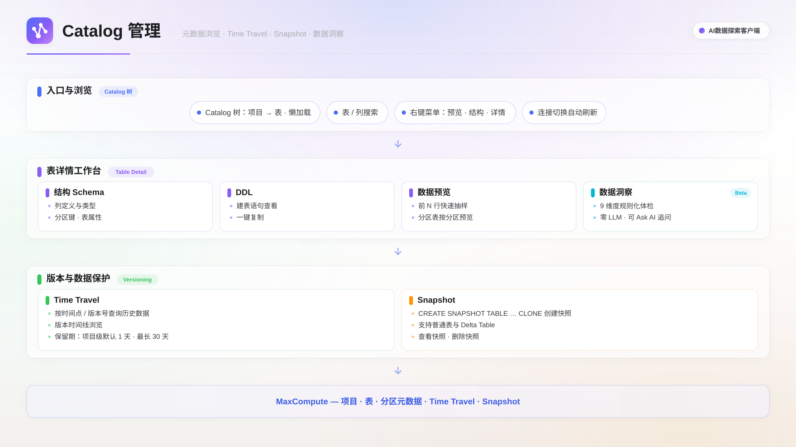

MaxCompute AI数据探索提供数据管理与表洞察能力：浏览项目中的表元数据，查看表结构、DDL、数据样本与权限，对单张表运行规则化的数据洞察体检，并通过 Time Travel 与快照回溯和保留历史版本。

## 适用场景

- **陌生表摸底**：接手新表时查看表结构、DDL 与样本数据，单击表名即可生成 SELECT 查询。
- **表健康体检**：对单张表运行规则化洞察，检查空值、重复、离群值与存储问题。
- **数据变化排查**：定位行数或指标异常波动的发生位置与可能原因。
- **历史版本保护**：查看版本时间线，回滚误写数据，或创建快照长期保留关键版本。

## 功能概述

数据管理围绕 Catalog 树展开：Catalog 面板提供表与列的浏览检索；双击表名进入表详情，查看表结构、DDL、数据预览与权限；**洞察**标签页对表做规则化体检；Time Travel 与快照负责版本回溯与长期保留。表、分区元数据与 Time Travel、Snapshot 能力均由 MaxCompute 提供。

## 前提条件

- 已创建并成功连接一个 MaxCompute 数据源。连接成功后 Catalog 自动加载。

## Catalog 浏览

在左侧活动栏**工作室**组中，单击**Catalog**图标（数据库形状）打开元数据浏览面板。面板以树形结构展示当前活动连接项目下的所有表，节点懒加载，切换活动连接后自动刷新。

树形层级按项目是否启用三层模型展示：

- **两层模型**：项目 → 表分组 → 表。
- **三层模型**：项目 → Schema → 表分组 → 表。

面板顶部提供搜索框，支持按表名和列名检索，搜索结果平铺展示并显示匹配数量。

表节点操作：

| 操作       | 结果                                                         |
| ---------- | ------------------------------------------------------------ |
| 单击表名   | 生成该表的 SELECT 查询并插入当前编辑器；无活动文件时自动新建 |
| 双击表名   | 打开表详情                                                   |
| 展开表节点 | 查看列定义（列名、数据类型、注释、是否分区列）               |

对分区表，展开表节点还可查看已有分区列表，也可通过 AI 助手执行添加分区操作。

## 表详情

在 Catalog 树中双击表名打开表详情，通过顶部标签页切换：

| 标签页          | 内容                                                                                                               |
| --------------- | ------------------------------------------------------------------------------------------------------------------ |
| **表结构**      | 表属性（名称、Owner、大小、行数、创建时间、最后修改时间、生命周期、表格式、是否 Delta 表、主键、存储层级）与列定义 |
| **DDL**         | 建表语句，支持一键复制                                                                                             |
| **数据预览**    | 样本数据，默认 100 行；分区表需指定分区值后预览，支持刷新重新加载                                                  |
| **权限信息**    | 表级别的权限信息                                                                                                   |
| **洞察**        | 规则化数据洞察体检（Beta），见下文                                                                                 |
| **Time Travel** | 版本查询、版本时间线与快照管理，见下文                                                                             |

## 表洞察 Insights（Beta）

**洞察**（Insights）标签页对单张表做一次规则化、零 LLM 的体检：所有结论由确定性规则计算得出，不调用任何大模型；仅当主动单击 **Ask AI** 时，相关上下文才交给 AI 助手做开放追问。

### 入口

1. 在 Catalog 树中双击目标表名，打开表详情。
2. 切换到**洞察**标签页，先看到 Overview 元数据卡（行数、大小、分区键、最后修改时间）与预估扫描量。
3. 单击 **Run Insights** 执行分析。

### 分析维度

分析结果按认知顺序分为四组：

| 分组     | 分析项        | 说明                                                                        |
| -------- | ------------- | --------------------------------------------------------------------------- |
| 健康概览 | Volume Trend  | 30 天分区行数与字节折线、数据新鲜度（freshness）、z-score                   |
| 健康概览 | Cadence       | 写入节奏：缺口、空分区、写入间隔中位数、写入延迟                            |
| 数据理解 | Profile       | 全列基数、空值率、数值列 min-max 与分位数、字符串长度；低基数列附 Top-K     |
| 数据理解 | Quality       | 主键候选、业务规则违反（如负金额、未来日期）、PII 风险启发式提示            |
| 数据理解 | Outliers      | 数值离群（Tukey IQR）与罕见值长尾                                           |
| 变化诊断 | Movement      | T、T-1、T-7 行数与数值列 sum/avg 对比；变化超过 10% 标警告，超过 30% 标严重 |
| 变化诊断 | Attribution   | 自动推断候选维度并按值计算 delta，标记新增与消失                            |
| 变化诊断 | Drift         | T 与 T-7 分布对比，高基数 ID 列用 HLL Jaccard 相似度；按需运行              |
| 优化建议 | Correlation   | 高基数数值列两两相关性，相关系数超过 0.95 时提示字段冗余；按需运行          |
| 优化建议 | Storage Hints | 归档候选、小文件碎片、Lifecycle 状态                                        |

### 采样与分区

- 运行前可调采样比例（0.1%、1%、10%、100%）与分析分区（默认按 T、T-1、T-7 自动推断，可手动覆盖）。
- Drift 与 Correlation 成本较高，默认折叠，按需单独运行。

### Highlights 与导出

- **Highlights** 汇总区按 critical、warning、info、healthy 四级排序，critical 与 warning 始终展开，同类条目合并；每条右侧可单击 **Ask AI** 追问。
- 顶部工具栏提供 **Copy**（复制汇总）、**Export MD**（导出 Markdown 报告）与 **Ask AI**（整体分析）。
- 结果缓存到本地：再次进入该表立即显示上次结果与运行时间，检测到表已更新时会提示刷新。

### SQL 抽屉

每个分析维度可展开其生成的 SQL，支持复制、复制到新 SQL Tab，或打开 Logview 查看作业执行详情。

### 已知局限

洞察结论文案较简洁；分区元数据存在 5～15 分钟的传播延迟；PII 提示为启发式判断，不构成合规级检测；未做整行重复检测，也不包含 Schema 漂移历史与血缘信息。

## Time Travel 与快照

**Time Travel** 标签页提供版本回溯能力，能力按表格式分档：

| 能力                                                | 普通托管表               | Delta / Transactional 表 |
| --------------------------------------------------- | ------------------------ | ------------------------ |
| 版本历史（`SHOW HISTORY FOR TABLE`）                | 支持                     | 支持                     |
| 版本回滚（`RESTORE TABLE ... TO LSN`）              | 支持                     | 支持，主键事务表除外     |
| 快照（`CREATE SNAPSHOT TABLE ... CLONE`）           | 支持                     | 支持                     |
| 时间旅行查询（`VERSION AS OF` / `TIMESTAMP AS OF`） | 不支持（`ODPS-0130071`） | 支持                     |

普通托管表也能查看版本时间线、回滚到历史版本、创建快照，仅时间旅行查询会提示格式不支持。主键事务表（PK Delta）不支持回滚，这是 MaxCompute 服务端限制（`ODPS-0110061`）：界面会禁用回滚按钮，并提示改用 `VERSION AS OF` 读取历史版本或先 `CLONE` 快照。

### 版本查询与时间线

- 通过版本偏移滑块选择要查看的历史版本，单击**执行查询**在编辑器中运行时间旅行 SQL，查看该版本的数据快照。
- 版本时间线展示表的变更历史，每条记录包含操作类型（CREATE、INSERT、INSERT INTO、INSERT OVERWRITE，以颜色区分）、时间与 LSN（日志序列号，用于精确定位版本）。
- 每条记录支持**预览**该版本数据、**复制 SQL**、**恢复到此版本**。

### 保留期

可回溯范围由项目备份数据保留天数（`odps.timemachine.retention.days`，默认 1 天，最大 30 天）决定；Delta 表另有独立的 `acidDataRetainHours` 配置（默认 168 小时 / 7 天）。超过保留期的历史版本标记为已过期，不可恢复。

### 快照

Snapshot 是表在某一时刻的只读副本，独立于 Time Travel 保留期，适合长期保存关键版本。支持普通表和 Delta 表，不支持 Transaction Table、视图和外部表。

创建快照：在快照区域单击**创建快照**，填写快照名称（默认格式 `表名_snap_时间戳`），设置生命周期（1～3650 天，默认 30 天）后确认。快照列表中每个快照支持删除，删除后不可恢复。

## 下一步

- 想把本地文件导入 MaxCompute 成为表，阅读[数据导入](./data-import.mdx)。
- 想把查询结果固化成可视化看板，阅读[数据看板](./dashboard.mdx)。
