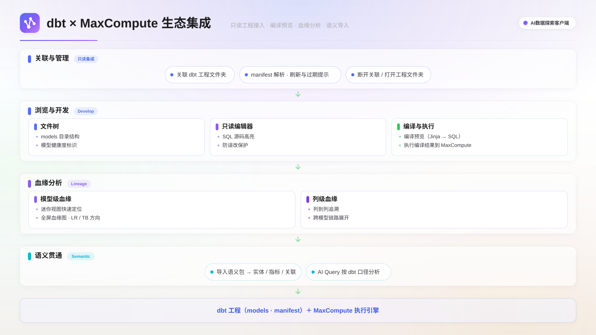

dbt 项目集成面向同时使用 dbt 做模型开发、MaxCompute 做湖仓计算的数据团队：在客户端内关联本地 dbt 工程，即可浏览模型结构、编译并执行 SQL、可视化数据血缘，并把语义资产沉淀为语义包供 AI Query 使用。

## 适用场景

- **联合管理 dbt 工程与 MaxCompute 加工链路**：在同一界面内完成模型查看与 SQL 执行，无需在编辑器、终端、dbt docs 之间切换。
- **模型变更的影响分析**：改动模型前通过血缘图看清上下游依赖，评估变更影响范围；列级血缘可进一步下钻到字段级别。
- **复用 dbt 语义资产**：把工程中已定义的 semantic models 与 metrics 转换为语义包，让 AI Query 基于统一口径的实体、指标、维度问答。

## 功能概述

客户端读取本地 dbt 工程的 `manifest.json`，在不调用 dbt CLI 的前提下完成模型浏览、SQL 编译预览、血缘分析与语义包导入。所有操作为只读模式，不修改 dbt 工程文件。

| 功能类别   | 功能项                                                        |
| ---------- | ------------------------------------------------------------- |
| 工程管理   | 关联项目、多项目切换、刷新 manifest、断开关联、打开工程文件夹 |
| 模型浏览   | 文件树、只读编辑器、ref()/source() 跳转与悬浮                 |
| 编译与执行 | SQL 编译预览、编译结果执行到统一结果栏                        |
| 血缘分析   | 模型级血缘图（全屏 + 迷你）、列级血缘、节点详情               |
| 语义沉淀   | semantic models / metrics 导入为语义包                        |



## 前提条件

- 已创建并连接一个 MaxCompute 数据源：执行编译后的 SQL 需要活动连接，血缘浏览不需要。
- 本地已有 dbt 工程，且工程根目录下存在 `dbt_project.yml` 和 `profiles.yml`。
- 已生成 `manifest.json`。如尚未生成，在终端运行以下命令后回到客户端刷新：

```bash
dbt docs generate
# 或
dbt compile
```

## 启用 Beta 开关

dbt 项目集成为 Beta 功能，开关默认开启。打开**设置 ▸ 生态接入 ▸ dbt**，确认**dbt 集成**（Beta）开关已开启；关闭后侧边栏不再显示 dbt 入口。

## 打开 dbt 项目

1. 在侧边栏**dbt 项目**面板，单击 **+**（关联项目）。
2. 在**项目路径**输入框填写 dbt 工程根目录路径；桌面端可单击**浏览**通过系统目录选择器选取。
3. 单击**关联**。客户端检测 `dbt_project.yml` 与 `profiles.yml`，并解析 `manifest.json`；通过后面板加载工程概览与文件树。

工程概览展示 dbt 版本、模型数、数据源数、指标数、工程路径与 manifest 最近更新时间。如需关联多个工程，重复上述步骤，面板顶部的下拉框可切换当前工程。

若 manifest 的修改时间早于工程文件的修改时间，面板会出现黄色提示条「manifest 可能已过期，建议刷新」。单击提示条或顶部刷新图标即可重新加载 manifest；刷新只读取磁盘文件，不会执行 `dbt compile`，模型有改动时请先在终端更新 manifest 再回到客户端刷新。

单击面板顶部的断开图标并在确认对话框中单击**确认断开**，即可解除关联；断开后需重新关联才能使用 dbt 功能。工程概览区的路径文本可单击，直接打开工程文件夹。

## 浏览模型与编译执行

### 只读编辑器

在文件树中单击 `.sql` 模型文件，标签页打开只读编辑器，支持 Jinja 语法高亮。编辑器中 `ref('模型名')` 与 `source('源名','表名')` 可 Cmd+Click 跳转到对应文件，悬浮可查看节点名称、类型、物化方式、描述与列信息。`.yml` 配置文件同样可打开查看。

### 编译预览与执行

1. 切换到底部面板的**SQL 编译预览**标签，单击**编译**（快捷键 Shift+Cmd+Enter）。
2. 编译成功后显示可执行的 SQL，右侧标注来源；失败时上方红色区域列出错误信息。
3. 单击**执行编译结果**（快捷键 Cmd+Enter），SQL 发送到当前 MaxCompute 连接执行，结果进入底部统一结果栏，可查看 Logview 进度、切换图表可视化并导出；也可单击**复制编译 SQL** 复制到剪贴板。

> **说明**
> 执行前需确保已连接 MaxCompute 实例，否则会提示「请先连接 MaxCompute 实例」。

## 查看血缘

### 迷你血缘

底部面板的**血缘**标签展示以当前模型为中心的迷你血缘图（默认上下游各 2 跳）：当前模型为高亮节点，上游蓝色、下游红色，左上角提供图例。存在下游时会显示「影响 N 个下游模型」，单击相邻节点可跳转到对应文件。

### 全屏血缘图

单击底部面板的**打开血缘图**进入全屏血缘图标签页：顶部提供搜索、布局方向切换（横向 LR / 纵向 TB）、缩放与适配，可按 source / model / exposure / metric 四类节点过滤。单击节点高亮上下游路径，双击打开对应文件，右键可复制表名；选中节点后底部展示描述、依赖、列信息等详情。

### 列级血缘

底部面板的**列级血缘**标签展示目标模型每个字段的来源字段映射：左侧按来源模型分组列出来源列，右侧为目标列，目标列按加工类型着色，左上角提供图例说明。

## 导入语义包

把 dbt 工程中的语义资产转换为语义包，供 AI Query 使用；语义包的概念与管理见[语义包](./semantic-pack.mdx)。

1. 在 dbt 面板单击**导入语义包**。
2. 在**目标语义域**输入框填写域名；留空则根据工程名自动生成。
3. 单击**导入**。客户端读取工程中的 `semantic_manifest.json`，把 semantic models、metrics、saved queries 转换为语义包（实体、指标、维度术语、关联、验证查询）。
4. 导入完成后自动编译该语义域进入运行时索引，AI Query 即可使用。

对话框会显示导入结果与有损转换提示（按严重程度分为 error / warning / info），例如 `derived` / `ratio` 指标的表达式引用其他指标名可能需手动调整、`saved_query` 转为占位 SQL 需手动补全实际查询。导入后建议对照提示在语义包中手动完善相应条目。

> **注意**
> 若目标语义域已存在，导入会覆盖原有内容。请确认域名无误后再执行。

## 下一步

- [语义包](./semantic-pack.mdx)：了解语义包的组成、构建方式与在 AI Query 中的使用。
