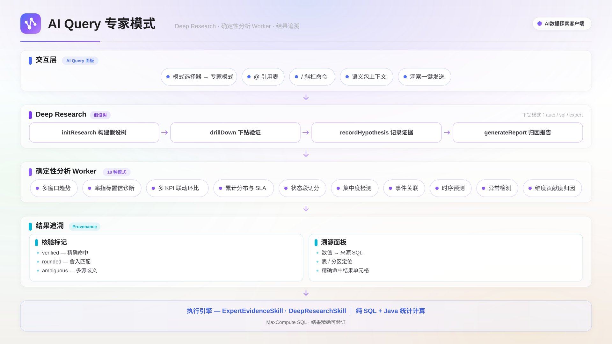

专家模式是 AI Query 的深度分析模式，面向指标归因与异常根因分析：Deep Research 沿假设树多轮验证，确定性分析引擎完成统计计算，结论中的关键数值可追溯到来源 SQL 与结果单元格。本页说明如何切换专家模式并使用深度分析能力。

## 适用场景

- 核心业务指标（如 GMV、DAU、转化率）突然下跌或上涨，需要找出根本原因。
- 指标变化涉及多个维度（如渠道、地域、用户群），需要逐层下钻定位。
- 需要巡检多项指标的健康状况、预测走势或识别异常数据点。
- 需要一份结构化的归因报告供团队决策。

使用前需已成功连接 MaxCompute 数据源，且待分析的表存在于连接的项目中。

## 功能概述

专家模式在 Agent 模式之上提供两类分析能力，分析过程零 LLM 计算，采用纯 SQL 与数学计算，结果精确可验证：

- **Deep Research**：假设树驱动的多轮深度研究，自动产出结构化归因报告。
- **确定性分析引擎**：9 种统计分析引擎，覆盖趋势、指标诊断、分布、结构与归因等场景。

## 切换到专家模式

在 AI Query 输入框左侧的模式选择器中切换：**Agent** 用于多步任务执行，**专家模式** 激活 Deep Research 与全部分析引擎。切换后，欢迎屏展示 10 张快速动作卡片，单击卡片自动填入对应的分析提问模板。

分析中可继续使用以下输入能力：

- 输入 `@` 引用表，单次对话最多 10 张，支持 `schema.table` 限定名；选中后自动预载表结构，便于引擎推断日期列与指标列。
- 输入 `/` 触发技能目录，可直接调用 Deep Research 或任一分析引擎。
- 通过语义域选择器绑定语义包后，自动加载其中的术语、指标定义与 JOIN 关系，提升生成 SQL 的准确性。

此外，Catalog 数据洞察标签页的分析结果可一键发送到 AI Query，作为专家模式的分析起点。

## 确定性分析引擎

引擎的执行方式为：AI 选择引擎并填入参数，引擎构建 SQL 并执行，计算后返回结构化发现。

| 引擎            | 用途                                                 |
| --------------- | ---------------------------------------------------- |
| 多窗口趋势分析  | 多窗口滑动聚合，检测趋势加速/减速拐点与 3σ 统计异常  |
| 率指标置信诊断  | 计算 Wilson 置信区间，识别小样本虚高的排名           |
| 多 KPI 联动环比 | 多指标联动环比，自动标出变化超 20% 的指标            |
| 累计分布与 SLA  | 计算分位数（P50/P90/P99）与 SLA 达标率，识别长尾分布 |
| 状态段切分分析  | 分析状态流转的停留时长，定位卡点状态                 |
| 集中度检测      | 计算 HHI 集中度指数，识别头部集中与刷量风险          |
| 事件关联分析    | 双表时间窗口 JOIN，计算事件关联率与平均延迟          |
| 时序预测        | Holt-Winters 指数平滑预测，输出预测值与置信区间      |
| 异常检测        | Z-Score、IQR、环比三方法投票，降低误报               |

在 9 种引擎之外，专家模式还提供**维度贡献度归因**：对指标变化按维度拆解贡献度，支持单维、交叉维度、因子分解与指标相关性四种方法。

## Deep Research

Deep Research 是假设驱动的多轮深度研究，按以下流程推进：

1. **初始化研究**：指定研究目标与待分析的因果维度（如 CTR、CVR、CPC），系统构建假设树。
2. **假设下钻**：对每个假设执行 SQL 分析并收集证据，判定为「已确认」「已排除」或「发现异常需进一步下钻」。
3. **多层递进**：对发现异常的假设继续展开子假设，逐层缩小范围。
4. **生成报告**：所有假设验证完毕后，汇总证据链生成结构化根因报告。

每次下钻支持三种方式：

| 模式   | 说明                               |
| ------ | ---------------------------------- |
| auto   | 自动选择分析方法，适合常规维度拆解 |
| sql    | 指定自定义 SQL 查询进行验证        |
| expert | 调用确定性分析引擎进行专项分析     |

示例提问：

> 请对 dws_trade_summary 的 gmv 进行深度研究，从 ctr, cvr, customer_price 维度分析近 7 天下降根因。

系统依次验证点击率、转化率、客单价三个维度的贡献，逐层下钻直到定位具体异常来源。

## 结果追溯

答案中引用的关键数值带有核验标记，单击标记打开溯源面板：查看来源表与分区、产生该数值的完整 SQL 查询，并在结果表格中高亮定位到精确命中的行与列；结果被行数上限截断时会明确标注。

| 核验状态 | 含义                                     |
| -------- | ---------------------------------------- |
| 已核验   | 数值与查询结果单元格精确匹配，唯一命中   |
| 近似核验 | 按显示精度舍入后唯一命中                 |
| 多处命中 | 数值在多个结果单元格中出现，展示全部候选 |

## 下一步

- 了解 Agent 模式的提问与执行流程，阅读[AI Query](./ai-query.mdx)。
