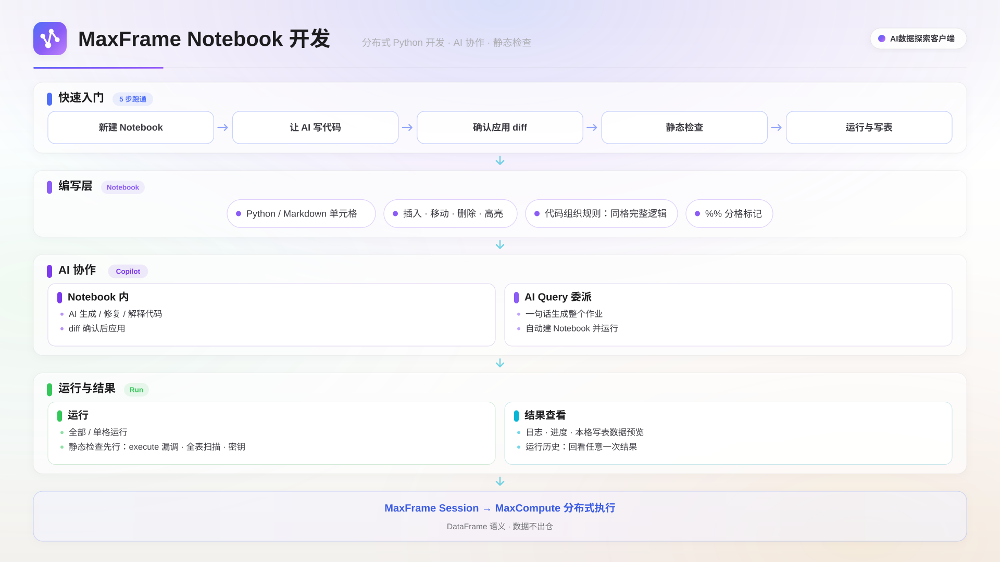

MaxFrame Notebook 是 MaxCompute AI数据探索客户端内置的 Python 数据加工模块。MaxFrame 是 MaxCompute 的分布式 Python 计算框架，API 与 pandas 高度兼容，计算在 MaxCompute 上完成，能处理远超单机内存的数据量；您可以逐格运行代码，查看每一步的输出与写入的目标表。

## 适用场景

- **多步数据加工**：抽取、清洗去重、脱敏、派生字段、写入结果表，用一个 Notebook 串起完整链路。
- **SQL 不好写的逻辑**：正则批量处理、复杂字符串加工、按行自定义计算、跨列派生等。
- **多模态数据处理**：配合 Blob 列类型，批量处理表中存储的图片、音频、视频。
- **让 AI 写作业**：描述清楚读哪张表、做什么、写到哪张表，由 AI 生成代码、自动检查并跑通。

## 功能概述

在客户端里不需要安装本地 Python 环境，也不需要配置 AccessKey：新建一个 Notebook 就能直接写代码运行，凭证按当前连接自动注入。支持 Python 与 Markdown 两种单元格、分段运行、静态检查、运行历史与 AI 协作。



## 前提条件

1. 已安装并启动客户端，配置好数据连接并选中要使用的 MaxCompute 项目。左侧栏的 MaxFrame 分区在没有活动连接时不显示；该功能为 Beta，分区标题带 `Beta` 标识。
2. 当前连接的账号对目标项目有读写权限（写结果表需要建表和写入权限）。
3. 使用 AI 功能前，在 设置 ▸ AI 配置 中填好 API URL、API Key 和模型名称。

## 新建与编辑 Notebook

在左侧栏 **MaxFrame** 分区单击右侧 **+**，填写名称（例如 `mf_my_pipeline`）后单击**创建 Notebook**，创建成功后自动打开编辑器；也可以从统一的新建文件对话框中选择 **MaxFrame** 类型创建。同一个项目下 Notebook 名称不能重复，内容自动保存，检查和运行前都会先保存。

Notebook 用注释标记划分单元格，本质上还是一个普通的 Python 文件：

| 标记              | 类型     | 用途                                       |
| ----------------- | -------- | ------------------------------------------ |
| `# %%`            | Python   | 可执行的加工代码                           |
| `# %% [markdown]` | Markdown | 步骤说明、假设、注意事项，不参与执行和检查 |

| 想做什么     | 怎么做                                                           |
| ------------ | ---------------------------------------------------------------- |
| 加一个单元格 | 在单元格之间或末尾的添加条上单击 **Python** 或 **Markdown**      |
| 改代码       | 单元格工具条上单击**编辑代码单元格**，改完单击**预览**回到渲染态 |
| 删除         | 单元格工具条上的**删除单元格**（至少保留一个 Python 单元格）     |

### 代码组织规则

每个单元格单独编译执行，但变量在单元格之间共享，因此：

- 每个单元格的代码块必须自己闭合：`try` / `if` / `for` / `def` 拆到两格会报语法错误，必须完整放在同一格。
- 变量可以跨格使用：前面创建的 `session`、算出的 DataFrame，后面的单元格直接使用；单元格最后一行是表达式时其值会自动打印，和 Jupyter 一样。MaxFrame 是懒执行的，不调用 `execute()` 计算不会真正提交；`overwrite=True` 表示每次全量覆盖结果表，表不存在时自动创建。

```python
# %%
import maxframe.dataframe as md
from maxframe.session import new_session
session = new_session()
# %%
daily = md.read_odps_table("project_with_dr.sales_detail").drop_duplicates(subset=["order_id"])
try:
    md.to_odps_table(daily, "project_with_dr.sales_daily", overwrite=True).execute()
finally:
    session.destroy()
```

## 运行与审批

| 方式     | 入口                       | 适用场景                                       |
| -------- | -------------------------- | ---------------------------------------------- |
| 运行全部 | 顶部**运行**               | 完整跑一遍，会先重置运行状态，从干净的环境开始 |
| 运行单格 | 单元格工具条**运行单元格** | 只改了某一格，复用前面已算好的变量做增量调试   |

代码里的 `to_odps_table(...).execute()` 执行完，结果就已写进 MaxCompute 表，不需要额外的发布或部署步骤。AI 改动 Notebook 前会弹出确认卡片：**改代码**展示改动摘要和理由，单击**应用到 Notebook** 生效、单击**取消**拒绝；**要运行**告知会重置运行状态并跑完全部 Python 单元格，单击**运行 Notebook** 才真正执行。

## 查看运行结果

每格运行后，下方分三个标签展示结果：

| 标签   | 内容                                                                                                  |
| ------ | ----------------------------------------------------------------------------------------------------- |
| 输出   | 代码打印的日志，可展开、收起、复制                                                                    |
| 目标表 | 自动识别这一格写入的表并展示数据预览，可切换前 20 / 50 / 100 行、刷新，或单击外链图标打开完整的表详情 |
| 控制台 | 错误信息和进度条                                                                                      |

同一格跑过多次时，右上角会出现选择器，按时间和状态回看之前某一次的结果，每格保留最近 10 次。输出区顶部显示本次运行的耗时、Instance ID 和**打开 LogView** 链接，需要排查 MaxCompute 侧问题时可直接跳转。编辑器下方还有三个可整体折叠的标签：

- **运行详情**：分为**摘要**、**标准输出**、**控制台**、**DAG** 四个子标签。摘要里看本次运行的状态与耗时，失败时标出失败位置并提供**让 Agent 修复**按钮；**DAG** 子标签查看作业的执行计划。
- **历史**：这个 Notebook 的全部运行记录（时间、模式、状态、耗时），失败的标红，可展开看详情；**Advisor** 标签展示最近一次检查发现的问题列表。

## 检查作业（Advisor）

单击顶部**检查**，客户端会在不真正跑作业、不消耗计算资源的前提下扫描 Python 代码（Markdown 内容不参与检查），主要覆盖四类问题。单击某条问题的**定位到**可以跳到对应代码行，也可以直接单击**让 Agent 修复全部**交给 AI 修改：

| 类别           | 典型问题                                                               |
| -------------- | ---------------------------------------------------------------------- |
| 作业跑不出结果 | 漏建 session、漏调 `execute()`、session 清理时机不对                   |
| 性能与成本风险 | 读分区表没限定范围导致全表扫描、把大结果集拉回本地、逐行处理大规模数据 |
| 安全问题       | 代码里硬编码密钥                                                       |
| 产出不完整     | 作业没有任何写表动作（只做分析时可忽略）                               |

## 作业助手（AI）

单击编辑器顶部的 **AI 续写**，右侧 AI 助手面板切到 **MaxFrame 作业助手**，空会话时提供三个快捷操作（AI 回复过程中可随时停止，停止后对话上下文完整保留；对话历史保存在服务端，单击面板顶部的时钟图标可找回之前的会话）：

| 快捷操作           | 做什么                                                               |
| ------------------ | -------------------------------------------------------------------- |
| 生成 Notebook 作业 | 生成完整作业：Markdown 写说明、Python 写逻辑，然后自动检查并申请运行 |
| 检查并修复         | 排查代码、session 生命周期、`execute` / 写表用法的问题，给出最小改动 |
| 解释当前作业       | 讲清楚输入表、关键变换、输出表和潜在风险，不改代码                   |

如果加工只是更大分析任务里的一环，直接在 AI Query 对话里说需求即可，AI 会把这段 MaxFrame 加工交给专门的子任务完成：Notebook 页面自动打开，代码与运行过程逐格实时显示；跑失败了子任务会读报错、自己改代码重跑，直到成功；右侧栏的子 Agent 列表里能看到作业状态，单击可跳回对应的 Notebook。建表、写表、`INSERT` / `UPDATE` 在 AI 对话主通道里会触发逐条确认，交给 MaxFrame 子任务后过程完整可见、可取消、可续跑，做完还会把输出表名带回来供后面的步骤引用。

## 注意事项

- 报 `expected 'except' or 'finally' block` 之类语法错误：代码块被拆到了两个单元格里，合并到一格即可。
- 同一个 Notebook 同时只能跑一个任务，提示「该草稿已有运行中的任务」时，等它结束（可在**历史**标签确认状态）或先取消再重试。
- 运行使用客户端内置的 Python 运行时，凭证按当前连接自动注入，不要也不需要在代码里写 AccessKey。

## 下一步

- 用 Python 扩展 SQL 的计算能力，阅读[UDF](./python-udf.mdx)。
- 用自然语言直接发起数据分析，阅读 [AI Query](./ai-query.mdx)。
