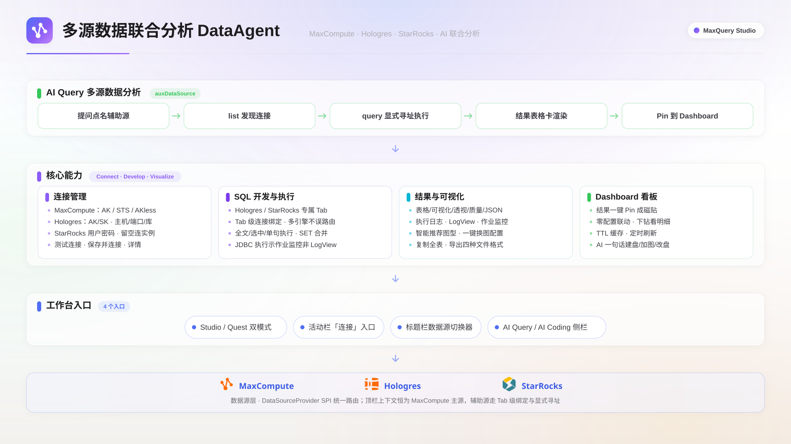

客户端在 MaxCompute 主数据源之外，还支持接入 Hologres 与 StarRocks 两类数据源：在同一客户端内完成 Catalog 浏览、SQL 开发与数据可视化，AI Query 也可同时连接三种引擎做多源数据联合分析。

## 适用场景

- **跨引擎取数比对**：把 MaxCompute 离线结果与 Hologres、StarRocks 实时结果放在同一工作台对照分析。
- **统一工作台**：多引擎的连接管理、SQL 编写执行与结果可视化在同一客户端完成，避免在多个工具之间切换。
- **AI 跨源问答**：在 AI Query 中点名辅助数据源，由 Agent 跨引擎发现连接并执行查询。

## 功能概述

三种引擎的定位、方言与访问方式各不相同：

| 维度         | MaxCompute               | Hologres                   | StarRocks                  |
| ------------ | ------------------------ | -------------------------- | -------------------------- |
| 定位         | 离线数仓                 | 实时数仓                   | 实时数仓                   |
| SQL 方言     | ODPS SQL                 | PostgreSQL 兼容            | MySQL 兼容                 |
| 执行模型     | 异步作业                 | 同步执行                   | 同步执行                   |
| Catalog 模型 | 项目 → Schema → 表 → 列  | 数据库 → Schema → 表 → 列  | Catalog → 数据库 → 表 → 列 |
| 认证方式     | AccessKey / STS / AKless | AccessKey（user/password） | 用户名 / 密码              |
| 执行诊断     | LogView · 执行日志       | 作业监控                   | 作业监控                   |

## 启用引擎开关

Hologres 与 StarRocks 为 Beta 阶段功能，由设置中的引擎开关控制，开关默认开启：

1. 单击标题栏**设置**（或按 ⌘,）打开设置对话框。
2. 在左侧导航选择**引擎设置**。
3. 打开或关闭**Hologres 引擎** / **StarRocks 引擎**开关：开启后可创建对应引擎连接、浏览 Catalog、编辑该引擎 SQL；关闭时相关连接、Catalog 与编辑入口隐藏。

> **说明**
> 关闭引擎只隐藏入口，不删除已保存的连接；重新开启后连接与功能恢复。

## 新建连接

在活动栏**工作室**组单击**连接**图标打开**数据源连接**面板，单击面板顶部的 **+**，在**数据源**中选择目标引擎。

### Hologres 连接

| 字段                            | 说明       |
| ------------------------------- | ---------- |
| 主机地址                        | 实例域名   |
| 端口                            | 默认 80    |
| 数据库名                        | 目标数据库 |
| AccessKey ID / AccessKey Secret | 访问凭证   |

填写后单击**测试连接**，通过后单击**保存并连接**。Catalog 浏览时自动排除系统临时 Schema。

### StarRocks 连接

| 字段          | 说明                                                                 |
| ------------- | -------------------------------------------------------------------- |
| 主机地址      | FE 节点地址                                                          |
| 端口          | 默认 9030（FE MySQL 协议端口）                                       |
| 数据库名      | 可留空；留空时连接整个实例，Catalog 根节点展开为数据库树，可跨库浏览 |
| 用户名 / 密码 | 访问凭证                                                             |

### MaxCompute 连接

MaxCompute 连接支持 AccessKey、STS 与 AKless 三种鉴权方式，配置方法见[MaxCompute 连接](./connection.mdx)。

### 连接管理

- **测试连接**在保存前验证凭证与网络可达性，失败时给出错误原因。
- 连接项提供**查看详情**（连接的 Catalog 适配信息）、**连接 / 断开**、**删除**操作；修改配置时删除后重建即可。
- 重启客户端后，所有已保存连接自动恢复。
- 面板底部汇总已覆盖地域与连接总数，列表支持按地域筛选。

## SQL 开发与执行

### 引擎标注与 Tab 级连接路由

SQL 文件按引擎目录组织：MaxCompute 文件位于根目录，Hologres 与 StarRocks 文件分别位于 `hologres/` 与 `starrocks/` 目录。打开非 MaxCompute 引擎的 SQL 文件时：

- Tab 工具栏显示引擎标识（如 **StarRocks SQL**）与该引擎的连接选择器。
- 在连接选择器中选择的连接仅作用于当前 Tab，不同 Tab 可绑定不同连接。
- 编辑器语法高亮与补全按对应引擎的 SQL 方言工作。

### 执行与诊断

1. 在工具栏的连接选择器中选择目标连接。
2. 输入该引擎方言的 SQL，单击**运行**；支持全文、选中、单句三种执行粒度。
3. 结果面板展示结果。Hologres 与 StarRocks 的执行不产生 LogView，诊断信息在**作业监控**页签查看。

## AI Query 跨源查询

1. 单击标题栏的 **AI** 按钮展开侧栏，确认位于 **AI Query** 页签。
2. 用自然语言提问并点名辅助数据源，例如「列出所有 Hologres、StarRocks 数据源连接」「查看 StarRocks 的 information_schema.tables 的前 20 行」。
3. Agent 调用对应引擎的工具完成连接发现与查询，查询结果以表格卡渲染在会话中。

## 注意事项

- Hologres 与 StarRocks 引擎为 Beta 功能，引擎开关默认开启；关闭开关只隐藏入口，已保存的连接不受影响。
- **测试连接**会同时验证凭证与网络可达性；连接失败时，按错误提示检查凭证是否正确、本机网络是否可访问对应实例地址。
- Hologres 与 StarRocks 为同步执行且不产生 LogView，执行诊断请查看结果面板的**作业监控**页签。
- 修改连接配置需删除后重建。

## 下一步

- [MaxCompute 连接](./connection.mdx)：配置 MaxCompute 连接与 AccessKey / STS / AKless 鉴权。
- [OSS 文件管理](./oss-files.mdx)：连接 OSS 数据源，管理 Bucket 与文件。
