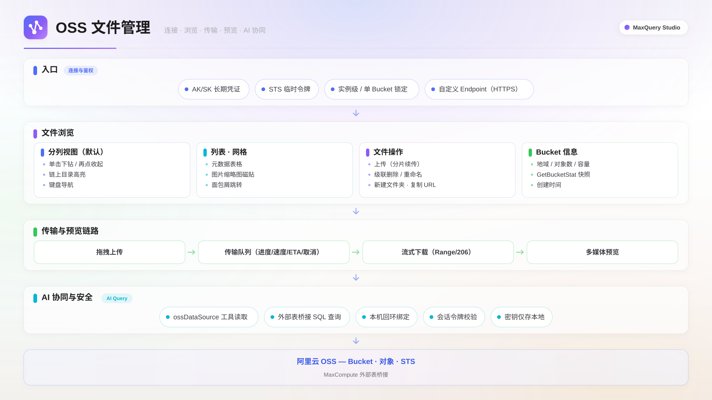

客户端支持连接阿里云 OSS（对象存储）数据源，在客户端内浏览 Bucket 与文件、上传下载、预览多媒体内容，并可通过 AI Query 直接对 OSS 数据提问，或把 OSS 数据桥接为 MaxCompute 外部表后用 SQL 查询。

## 适用场景

- 数据探索过程中需要直接查看和管理 OSS 上的文件，无需切换到 OSS 控制台。
- 本地向 OSS 批量上传数据文件，或把 OSS 文件下载到本地。
- 快速预览图片、音视频、PDF、文本与 Office 文档。
- 用自然语言探索 OSS 数据，或把 OSS 上的 CSV / Parquet 注册为 MaxCompute 外部表查询。

## 功能概述

OSS 文件管理以连接为单位组织能力：连接建立后可在 Catalog 中浏览 Bucket；Bucket 以独立 Tab 打开，提供分列、列表、网格三种文件视图与常用文件操作；上传下载进入传输队列；单击文件即可预览；AI Query 可直接引用 OSS 连接。

## 前提条件

- 已在阿里云开通 OSS 服务并创建 Bucket。
- 已获取 AccessKey ID / AccessKey Secret，或 STS 临时凭证（AccessKey + Security Token）。
- **设置 ▸ 引擎设置**中**OSS 对象存储**开关已开启（默认开启；历史版本手动关闭过的需重新开启）。

## 连接 OSS 数据源

### 鉴权方式

| 鉴权方式                 | 适用场景            | 填写内容                                               |
| ------------------------ | ------------------- | ------------------------------------------------------ |
| AccessKey Authentication | 长期使用本机开发    | AccessKey ID、AccessKey Secret                         |
| STS Token Authentication | 临时授权 / 共享凭证 | STS AccessKey ID、STS AccessKey Secret、Security Token |

### 新建连接

1. 在侧边栏**连接**区域，单击 **+ 新建连接**。
2. 在数据源卡片中选择 **OSS**。
3. 在**地域 / Endpoint**下拉中选择 Bucket 所在地域；跨地域或自建兼容端点选择**自定义**填写。
4. 按上表填写鉴权信息。**Bucket** 留空表示实例级连接，可浏览账号内全部 Bucket；填写则锁定单个 Bucket。
5. 单击**测试连接**，验证通过后保存。

> **说明**
> STS 临时凭证有效期约 1 小时（可配置最长 12 小时），过期后连接会报错，重新填入新 Token 即可恢复。自定义 Endpoint 的公网地址仅支持 HTTPS；环回与私有网段地址可使用 HTTP。

## 浏览 Bucket 与文件

在 Catalog 侧边栏展开 OSS 连接，双击 Bucket 节点（或悬停后单击 **i** 按钮）打开独立的 Bucket 管理 Tab。Tab 顶部信息条显示 Bucket 的地域、对象数量、容量与创建时间。

### 分列视图与视图切换

Bucket 管理 Tab 默认使用分列视图，工具栏可切换为列表或网格视图：

| 视图     | 特点                                                                   |
| -------- | ---------------------------------------------------------------------- |
| 分列视图 | 每列一层目录，单击文件夹下钻，再单击一次收起；链上目录高亮标识当前路径 |
| 列表视图 | 表格展示名称、大小、类型、修改时间，适合按列浏览                       |
| 网格视图 | 磁贴布局，图片文件直接显示缩略图                                       |

左侧文件树可按目录层级折叠展开，顶部面包屑支持跳转任意上级目录。分列视图支持键盘操作：方向键移动、Enter 下钻、Backspace 上退。

### 文件操作

| 操作       | 方式                                   | 说明                                                                                  |
| ---------- | -------------------------------------- | ------------------------------------------------------------------------------------- |
| 新建文件夹 | 工具栏**新建文件夹**                   | 在当前目录创建                                                                        |
| 重命名     | 行内**重命名**按钮或右键菜单           | 文件与文件夹均支持；文件夹重命名级联移动其下对象，单次最多 5000 个                    |
| 删除       | 行内**删除**按钮或右键菜单             | 级联删除，大数据量目录（数千对象）数秒内完成；单次最多 100,000 个对象，超出可重试续删 |
| 上传       | 拖拽文件到文件区，或工具栏**上传文件** | 支持多文件与文件夹结构上传，单批最多 299 个文件                                       |
| 下载       | 行内**下载**按钮                       | 单文件与批量均进入传输队列                                                            |

## 传输队列

上传与下载任务统一进入底部状态栏的传输队列：每个任务实时显示百分比、已传输大小、速度与剩余时间（ETA）；任务进行中可单击取消，客户端同步中止，不留残余任务；完成的任务保留 6 小时供查看，之后自动清理。

## 文件预览

单击文件打开预览 Tab，支持以下格式：

| 格式                         | 预览方式                           |
| ---------------------------- | ---------------------------------- |
| 图片（PNG / JPEG / WebP）    | 直接显示，大图支持流式传输与缩略图 |
| 音频 / 视频                  | 播放器播放，支持拖动进度条         |
| PDF                          | 文档视图                           |
| 文本 / CSV / Markdown / JSON | 只读代码视图，自动识别语言高亮     |
| Office（docx / xlsx / pptx） | 内嵌渲染                           |
| 未知二进制                   | 十六进制视图                       |

单文件预览上限 50 MB，超出时请下载后用本地应用打开。分列视图右侧的**快速预览**面板可在不打开新 Tab 的情况下查看选中文件。

## AI Query 读取 OSS 数据

在 AI Query 对话中可直接引用 OSS 连接：

- **自然语言浏览**：例如「列出 OSS 连接下的 bucket」「查看 my-bucket 的文件清单」。
- **内容读取**：让 AI 读取 OSS 上的文本 / CSV 内容并分析。
- **外部表桥接**：将 OSS 上的 CSV / Parquet 注册为 MaxCompute 外部表后用 SQL 查询，例如「把 my-bucket 的 CSV 注册成 MaxCompute 外部表」。

## 注意事项

客户端与 OSS 的所有请求经本机服务转发，AccessKey 仅保存在本地数据库，不会上传到任何第三方服务，局域网内其他设备无法访问。遇到以下报错时，可按对应方式处理：

- **测试连接报「bucket 不存在或无权访问」**：当前 AccessKey 缺少该 Bucket 的 ListObjects 权限。请在 RAM 控制台为该 AccessKey 授予对应 Bucket 的读权限，或改用实例级连接（Bucket 留空）确认可访问的 Bucket 列表。
- **删除大目录时提示超出上限**：删除操作是幂等的，按提示重试即可从剩余对象继续；目录超过 100,000 个对象时，建议先在 OSS 控制台按前缀分批处理。
- **连接突然报 403 / 凭证错误**：使用 STS 鉴权时通常是 Token 已过期，重新获取 STS 凭证并在连接中更新即可。

## 下一步

- [多模态管理](./multimodal-blob.mdx)：浏览与预览 MaxCompute Blob 数据，用 MixCompute 编排多模态计算。
- [Hologres 与 StarRocks](./multi-datasource.mdx)：在同一客户端接入 StarRocks 与 Hologres 引擎并行探索数据。
