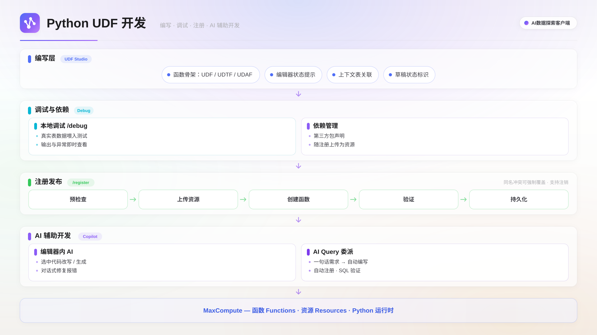

Python UDF 开发用于应对 SQL 内置函数无法表达的自定义计算场景。在客户端内完成编写、语法检查、本地调试、依赖打包与注册发布，避免在本地装环境、手工打包上传、反复提交作业试错。

## 适用场景

- **字段清洗与标准化**：手机号脱敏、地址归一、编码转换等 SQL 表达式冗长的逐行处理。
- **业务规则封装**：把风控评分、标签判定等规则固化成一个函数，供多个 SQL 作业复用。
- **复杂解析**：解析 JSON、日志串、半结构化文本，一行输入拆成多行或多列输出。
- **借助第三方库计算**：引入纯 Python 包，获得内置函数不具备的计算能力。

## 功能概述

UDF（User Defined Function，用户自定义函数）是 MaxCompute 提供的扩展机制，用于在 SQL 中调用自己实现的计算逻辑。客户端把这套流程集成在一个工作台里：左侧管理 UDF 草稿，中间是代码编辑器，下方面板承载六个子标签：

| 标签         | 用途                                                       |
| ------------ | ---------------------------------------------------------- |
| Data         | 绑定上下文表后展示列名、类型、分区标识与注释，并可预览数据 |
| SQL          | 生成引用上下文表的验证语句，运行查看结果与 LogView         |
| Dependencies | 添加 Python wheels 第三方依赖，复用项目资源                |
| Debug        | 用真实表数据采样在本地调试                                 |
| Register     | 展示函数名、语言与资源清单，执行注册、强制覆盖、注销       |
| History      | 编译历史、调试历史                                         |

草稿保存在本地，只有单击**注册到 ODPS**（ODPS 是 MaxCompute 的服务端标识，客户端界面沿用该名称）后才会真正发布到 MaxCompute 项目，因此可以放心地反复修改和调试。侧边栏草稿列表中，名称后的 **UDTF** / **UDAF** 徽标标明函数类型，黄色圆点表示代码已修改但尚未重新注册；在草稿上单击右键可以**加入聊天**、**复制名称**或**删除**。



## 前提条件

- 已创建并成功连接一个 MaxCompute 数据源，并选定项目。UDF 入口依赖活动连接，未连接时不可用。

## 开发流程

一个 UDF 从编写到可用经过五步：编写函数 → 语法检查 → 本地调试 → 注册到 MaxCompute → 在 SQL 中验证。以下用「把字符串转为大写」的 `str_upper` 为例。

### 编写函数

在侧边栏 **UDF** 分区单击 **+** 新建草稿（也可在统一新建对话框中选择 **UDF** 类型），填写函数名、类型与参数签名，可选绑定一张**上下文表**供调试和 SQL 验证自动带出表名与列名。创建时选择的类型决定生成的代码骨架：

| 类型 | 说明                   | 生成的基类与方法                                                    |
| ---- | ---------------------- | ------------------------------------------------------------------- |
| UDF  | 一行输入对应一行输出   | 普通类，实现 `evaluate`                                             |
| UDTF | 一行输入可产生多行输出 | 继承 `BaseUDTF`，实现 `process`，通过 `self.forward()` 输出         |
| UDAF | 多行输入聚合为一个结果 | 继承 `BaseUDAF`，实现 `new_buffer`、`iterate`、`merge`、`terminate` |

UDF 类型生成的骨架，函数签名由创建时填写的参数签名决定；UDTF 需要在**参数签名**中通过**添加输出列**声明多个输出列：

```python
from odps.udf import annotate

@annotate('string -> string')
class str_upper(object):
    def evaluate(self, a):
        return a
```

编辑器提供 Python 语法高亮、括号配对着色与自动换行，代码修改自动暂存，无需手动保存。编辑器顶部会提示草稿与 MaxCompute 的一致性：从未注册过时提示可注册；已注册但代码又被修改时，黄色警告条提示「代码已修改，ODPS 上运行的仍是上次注册的版本」，需重新注册才生效。单击顶部栏**选择表**可绑定或更换上下文表，单击表名旁的 **×** 解除绑定。

### 语法检查

单击顶部**语法检查**，状态区显示**语法检查通过**表示代码可编译。本例中把 `evaluate` 的返回值改为 `a.upper()` 即可通过。

### 本地调试

本地调试在您的机器上用真实表数据跑一遍 UDF，不提交 MaxCompute 作业，不消耗计算资源。

1. 切换到下方 **Debug** 标签，填写调试参数：

   | 参数         | 说明                                   |
   | ------------ | -------------------------------------- |
   | 表名         | 格式为 `<project_name>.<table_name>`   |
   | 输入列       | 多列以英文逗号分隔，按顺序对应函数入参 |
   | 分区（可选） | 格式为 `ds=20260101/hh=00`             |
   | 采样行数     | 默认 100 行，最大 1000 行              |

2. 单击**运行调试**。执行依次经过**Python 语法预检**、**采样输入**、**执行 UDF** 三个阶段，运行中可单击停止按钮中断。
3. 查看结果：结果区显示结果行数、退出码与耗时，输出逐行以表格呈现；**标准错误**可展开查看 `print` 与异常堆栈，便于定位问题。调试结束状态包括**成功**、**失败**、**超时**、**内存溢出**、**占用本机内存过高被终止**和**已取消**，后两种说明采样数据或函数内存占用过大，建议减少采样行数后重试。

### 第三方依赖打包

在 **Dependencies** 标签的 **Python wheels** 页为 UDF 添加第三方库：

1. 输入依赖声明（例如 `numpy==1.26.4`），单击**添加**。客户端从 PyPI 解析并下载 wheel 包，同时下载适配服务端与本地调试的两份产物。
2. 添加成功后依赖自动注入源码的 `sys.path`，代码中直接 `import` 即可。
3. 若项目中已有其他草稿上传过资源，单击**复用项目资源**直接选用，避免重复上传。常见失败原因：依赖仅提供平台相关的编译 wheel、包只发布了源码包（sdist）、包名拼写有误，这些情况说明该依赖不属于纯 Python 包，请改用等价的纯 Python 实现，或参照 MaxCompute 官方文档手动上传资源。

### 注册到 MaxCompute

单击顶部**注册到 ODPS**，或在 **Register** 标签确认资源清单（函数名、语言、资源的类型 / 路径 / 大小 / sha256）后再发布。注册按五个阶段推进，状态区实时显示进度：**预检查**（校验草稿完整性并计算资源清单）→ **上传资源**（把代码与依赖上传为 MaxCompute 资源，显示 `已上传/总数` 计数）→ **创建函数**（执行 `CREATE FUNCTION`）→ **校验**（可选，勾选**注册后校验**时执行）→ **持久化**（记录注册结果，编辑器的未注册提示随之消失）。

**注册后校验**默认关闭。勾选后客户端会在 MaxCompute 上提交一条冒烟查询，确认函数能够正常加载。该校验会提交真实作业、耗时较长并产生计算费用，但能提前暴露「注册成功却调用失败」的问题，建议在正式交付前至少执行一次。校验先用 Python 3.11（cp311）验证，再用服务端默认的 Python 2.7（cp27）验证；后者未通过时注册仍会保留，但会给出警告，提示不带 cp311 声明的裸 SQL 调用可能失败。

若 MaxCompute 上已存在同名资源或函数，注册会失败并提示 **ODPS 上已存在同名函数**。此时可单击**强制覆盖**，用当前草稿覆盖线上的同名资源与函数；或取消本次注册，改用其他函数名。在 **Register** 标签单击**注销**可从 MaxCompute 移除该函数的注册，本地草稿仍会保留。

> **重要**
> 强制覆盖会直接替换线上正在使用的函数实现，可能影响依赖该函数的线上作业。请确认影响范围后再执行。

### 在 SQL 中验证

注册完成后即可在 SQL 中调用。由于服务端默认运行时为 cp27，建议显式声明运行时版本：

```sql
SET odps.sql.python.version=cp311;
SELECT str_upper(name) FROM <project_name>.<table_name> LIMIT 10;
```

**SQL** 标签提供同样的验证入口：生成一条引用上下文表的查询语句，运行时自动在语句前追加 `SET odps.sql.python.version=cp311;`，单击**运行**即可查看结果与 LogView。

## 用 AI 开发 UDF

- **在 UDF 编辑器内**：打开草稿后在 AI 对话侧栏用自然语言描述需求，例如「把身份证号中间 8 位替换成星号」，AI 读取当前草稿后给出改动并等待确认。输入框输入 `@` 可引用上下文（例如把某张表的结构带给 AI）；输入 `/` 可调用命令：`/build`（编译 / 语法检查）、`/register`（注册 UDF 到 ODPS）、`/debug`（本地调试）。改写源码、添加依赖、执行调试、执行 SQL、注册等涉及改动或发布的操作都会先弹出审批卡，单击**批准**后才执行。
- **在 AI Query 中委派开发**：直接提出带 UDF 的需求，例如「写一个把手机号脱敏的 UDF，注册后统计各城市的去重用户数」，AI 会交给专门的 UDF 子任务完成。编辑器自动打开并随每次改写同步刷新；AI Coding 面板按时间线记录**UDF 草稿**、**UDF 代码更新**、**UDF 已发布**等节点，语法检查失败时 AI 自行修复并重新检查；发布环节一定会弹出人工确认卡片，确认后才会执行 `CREATE FUNCTION`。

## 下一步

- 用 pandas 风格的代码做大规模数据加工，阅读[MaxFrame](./maxframe-notebook.mdx)。
