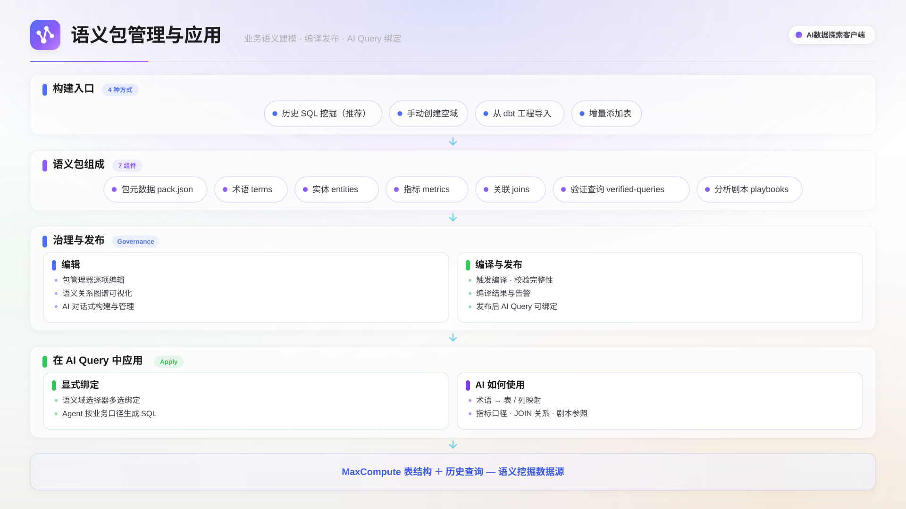

## 功能概述

语义包（Semantic Pack）是一组描述数据资产业务含义的结构化文件。客户端从 MaxCompute 历史 SQL 中挖掘业务事实，经 LLM 增强后生成术语、实体、指标、关联等定义，编译为运行时索引，供 AI Query 在生成 SQL 时参考。每个语义包隶属于一个**语义域**（domain）。语义域是语义包的逻辑隔离单元，对应一个独立的文件目录，可为不同业务线或数据主题创建不同的域。

语义包从构建到应用的链路如下图所示。

### 适用场景

- **提升 AI 问数准确率**：对话中绑定语义包后，AI 规划 SQL 时可参考术语定义、指标口径与表间关联，减少字段误用和口径偏差。
- **沉淀团队分析经验**：把反复出现的维度命名、指标公式、常用 JOIN 条件固化下来，新成员无需重新探索。
- **验证 SQL 正确性**：验证查询是经人工确认的标准 SQL，AI 生成结果时可参照已有模式，降低幻觉。

## 前提条件

- 已在**设置 ▸ Beta**中启用语义包开关（默认关闭，启用后活动栏「智能」组出现**语义包**入口）。
- 已创建并成功连接一个 MaxCompute 数据源，且已选定项目。
- 使用「从历史 SQL 挖掘构建」时，该项目需有一定量的历史查询记录（建议至少 7 天）。

## 快速入门

1. 在侧边栏**语义包**分区，单击 **+**（新建语义包）。
2. 填写包名和描述，选择 1~3 张种子表与挖掘窗口（7 天或 14 天），单击**开始构建**。
3. 等待挖掘完成（耗时取决于历史 SQL 量），右侧栏展示构建进度。挖掘结束后核对相关表和候选关联，单击**确认并继续**。
4. 草稿生成后，选择是否启动 LLM 增强（补充描述与同义词），单击**开始增强**。
5. 增强完成后进入审核，确认内容无误后单击**发布**。语义包自动编译进入运行时索引。
6. 在 AI Query 对话中说「使用 xxx 语义包」绑定该域，随后提问。绑定后 AI 参考其中的术语与指标口径生成 SQL。

## 语义包的组成

| 组件     | 文件                    | 作用                                             |
| -------- | ----------------------- | ------------------------------------------------ |
| 包元数据 | `pack.json`             | 域名称、描述、关键词、默认表、默认指标与维度     |
| 术语     | `terms.json`            | 业务术语的中英文同义词与描述                     |
| 实体     | `entities.json`         | 数据实体（对应表），定义主键、描述与字段含义     |
| 指标     | `metrics.json`          | 业务指标的计算表达式、聚合方式、相关维度与同义词 |
| 关联     | `joins.json`            | 表与表之间的 JOIN 条件与连接类型                 |
| 验证查询 | `verified-queries.json` | 经人工确认的标准 SQL，供 AI 参照模式             |
| 分析剧本 | `playbooks.json`        | 常见分析场景的步骤描述、所需表与首选指标         |

## 构建语义包

推荐使用**从历史 SQL 挖掘构建**，构建向导分 5 个阶段：

| 阶段     | 说明                                                                                                          |
| -------- | ------------------------------------------------------------------------------------------------------------- |
| 准备     | 填写包名、域 ID（留空自动生成）、描述，选择种子表与挖掘窗口天数（2 / 7 / 14 天）                              |
| 挖掘     | 扫描历史 SQL 中与种子表相关的查询，提取 JOIN 候选、指标候选和共现统计；完成后等待用户核对相关表清单和候选关联 |
| 草稿     | 基于确认后的表元数据与采样数据，生成术语、实体、指标、关联、验证查询等 8 类语义资产                           |
| 增强     | LLM 在保留挖掘证据的前提下补充描述、同义词与业务说明；可选择增强范围（全部或指定组件）                        |
| 审核发布 | 用户审核全部内容，确认后发布到运行时索引                                                                      |

> **说明**
> 构建是后台任务，可以切换到其他页面继续工作，回来后进度不丢失。每个阶段执行完毕后会进入等待状态，需用户确认后才继续下一阶段，构建进度在右侧栏实时显示。

### 其他构建方式

- **手动创建空域**：在 AI Query 对话中说「创建一个名为 xxx 的空语义包」，随后在编辑界面逐项添加组件。适合已有明确语义定义的场景。
- **从 dbt 工程导入**：在 dbt 面板单击**导入语义包**，把 dbt 工程中的 semantic models 和 metrics 转换为语义包。详见[dbt 集成](./dbt-integration.mdx)。
- **增量添加表**：对已有语义包，通过**添加表**操作追加新表。客户端读取该表的元数据和采样数据，为其生成实体定义、字段描述和关联候选。

## 编辑语义包

在侧边栏单击已有语义包，打开编辑标签页。标签页内含两个子视图：

- **包管理器**：以列表形式展示各组件，支持添加、编辑、删除条目，以及对指定组件单独调用 LLM 补充描述与同义词。修改后需重新编译，AI Query 才能使用最新内容。
- **语义关系图谱**：以可视化方式展示实体、指标、术语之间的引用与关联拓扑，便于从全局视角理解语义包的覆盖范围与结构完整性。

## 编译与发布

编译把语义包各组件文件合并为一份运行时索引（`index.json`），供 AI Query 加载使用。触发方式：在编辑标签页保存修改时自动编译；构建任务的审核发布阶段自动触发；删除某个域后异步重编译剩余域；在 AI Query 中说「编译 xxx 域」。

编译成功后，运行时索引即刻生效，下一轮 AI Query 对话即可使用；若发现问题（如字段引用不存在的表），会生成验证报告供排查。侧边栏语义包列表区分两个分区：**已发布**（编译通过、可正常使用）与**异常/未编译**（尚未编译或编译失败，需处理后才能被 AI Query 引用）。

## 在 AI Query 中使用语义包

### 绑定语义包

AI Query 不会自动加载所有已编译的语义包。在对话中说「使用 xxx 语义包」或「绑定 xxx 域」，即可把指定域加入当前会话的语义上下文。绑定是会话级概念，仅影响当前对话；绑定后同一会话内的后续提问都会参考该语义包，无需每轮重复绑定。

### 绑定后的增强

| 能力         | 作用                                                            |
| ------------ | --------------------------------------------------------------- |
| 表结构预注入 | 实体对应的表结构预加载到上下文，AI 无需额外查询元数据           |
| 术语理解     | 用户说「客单价」时，AI 通过同义词映射到对应的计算表达式         |
| 指标口径     | 生成聚合 SQL 时参考指标定义的计算表达式与聚合方式，保证口径一致 |
| 关联路径     | 多表查询时参考关联定义选择 JOIN 条件，减少笛卡尔积风险          |
| 验证查询参照 | 生成的 SQL 结构可参照验证查询中的已知模式，降低错误率           |

## 用 AI 构建与管理语义包

在 AI Query 对话中用自然语言即可操作语义包：

| 动作 | 指令示例                                                                                         |
| ---- | ------------------------------------------------------------------------------------------------ |
| 查看 | 「列出所有语义包」「查看 sales 域的指标」                                                        |
| 绑定 | 「使用 ecommerce 语义包回答接下来的问题」                                                        |
| 构建 | 「为 sales_order 表创建一个新的语义包」，AI 发起构建任务并在右侧栏显示进度，决策点会暂停等待确认 |
| 编辑 | 「给 sales 域添加一个指标：日均订单量 = COUNT(order_id) / DATEDIFF(...)」                        |
| 编译 | 「编译 sales 域」                                                                                |

## 删除语义包

1. 在侧边栏语义包列表中选择目标域，单击**删除**。
2. 在确认对话框中单击**确认删除**。域目录被移除，客户端异步重编译剩余域的运行时索引。

> **重要**
> 删除操作不可撤销。若 AI Query 对话中正在使用该域，删除后当前会话的语义增强会立即失效。

## 下一步

- 阅读[AI Query](./ai-query.mdx)，了解绑定语义包后的问数用法。
- 使用 dbt 工程时，阅读[dbt 集成](./dbt-integration.mdx)。
